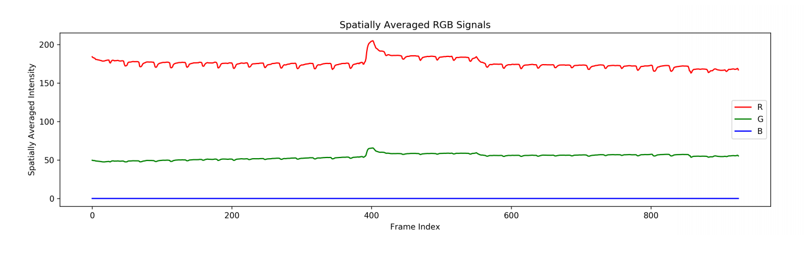
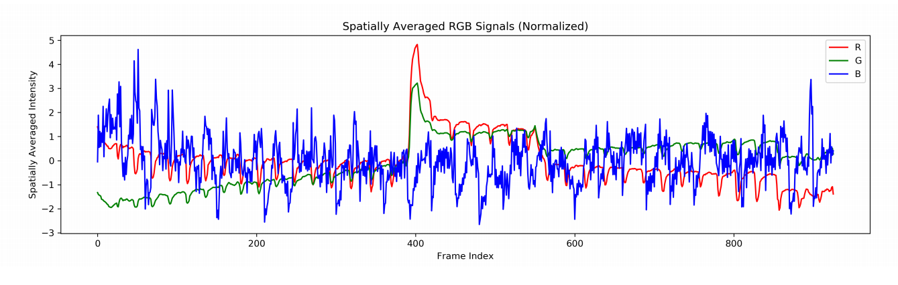
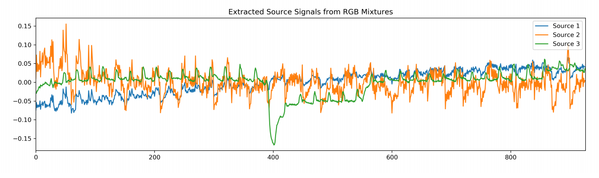
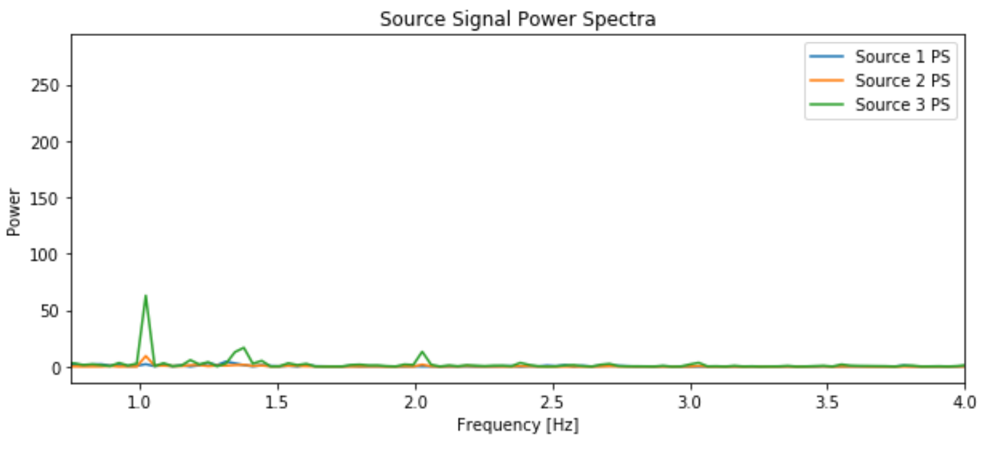
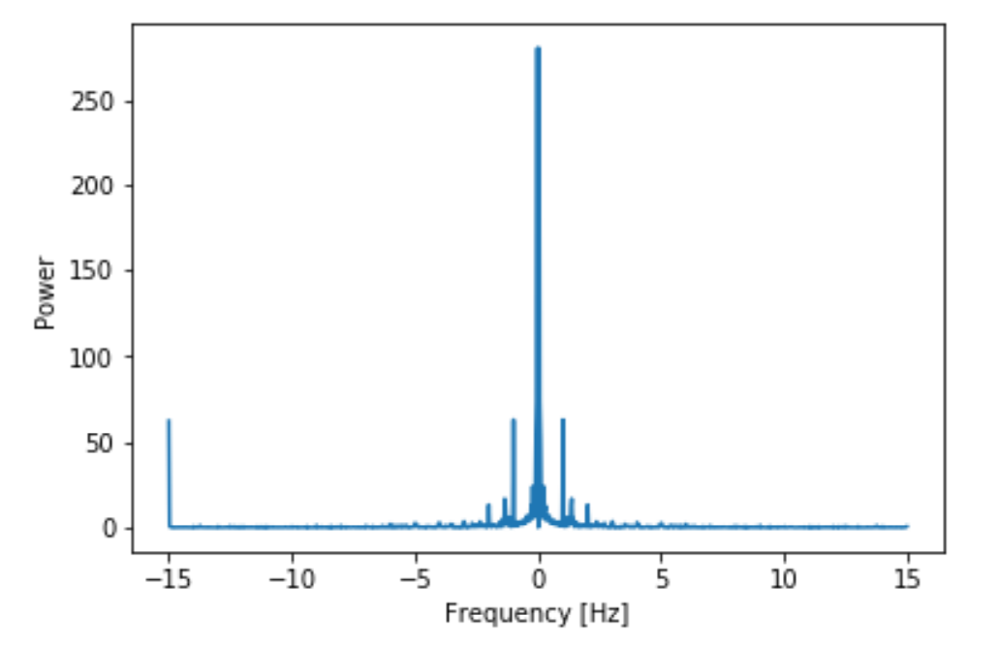

# Introduction

This is just one of many projects for this lab. I chose this one specifically because I really liked how it combined image processing with FFT which is what I was learning about at the time.

# Problem Overview

In this project, we will create a detector from a video shot from an IPhone.


<video width="320" height="240" controls>
	<source src="data2.mov" type="video/mov">
</video>


Our detector will be based on the fact that your heart rate drives the flow of blood through your
body. If we take a close-up video recording of a person's thumb — other body parts will work too,
but it's easiest to just hold your thumb over your cell phone camera — and consider each RGB
channel as a separate signal (each image or "frame" of a video encodes Red, Green, and Blue
(RGB) values) of the recording, it will give us information about the blood flow through that region of
their body during the recording, based off how well blood is captured by different wavelengths of
light in the camera. However, this data is a video, which is three-dimensional (one for time to select
which frame/image you want, one to select the image's x-axis pixel, one to the select the image's
y-axis pixel; the signal value is the pixel intensity), and we only know how to work with 1D signals in
EE 120.

# Overview of Plan to Compute Heart Rate

The way to solve this one is to devise an algorithm in which we separate the signals to RGB through dimensionality reduction, 
get the source of those signals through an algorithm called Independent Component Analysis, then do spectral analysis to find the 
largest spike in the frequency domain.

# Algorithm Walkthrough

First, we need to turn the video data into some sort of thing that we can extract. First, we take the RGB channels and try doing a
spatial average across red, green, and blue pixel values.

````
xr_video = video_data[:, :, :, 0]
xg_video = video_data[:, :, :, 1]
xb_video = video_data[:, :, :, 2]

xr = np.mean(xr_video, axis=(1,2))
xg = np.mean(xg_video, axis=(1,2))
xb = np.mean(xb_video, axis=(1,2))
````





Then we normalize the data:

````
xr_normalized = np.divide(np.subtract(xr, np.mean(xr)), np.std(xr))
xg_normalized = np.divide(np.subtract(xg, np.mean(xg)), np.std(xg))
xb_normalized = np.divide(np.subtract(xb, np.mean(xb)), np.std(xb))
````




Next, we need to reduce the noise of the signals. We choose to do an algorithm called source separation. What this means is that we assume that the
RGB signals are linearly separable. In this way, we simplify the problem to something that can be linearly tractable and easier to solve. We choose
the hyperparameter of source signals to be 3 just so we can have a solution based on the number of signals we have.

More specifically we can run ICA or independent source analysis and get a less noisy waveform:

````
data = [0] * xr_normalized.shape[0]
for n in range(xr_normalized.shape[0]):
 data[n] = [xr_normalized[n], xg_normalized[n], xb_normalized[n]]
data = np.array(data)

ica = FastICA(n_components=3)
sources = ica.fit_transform(data)

````




Now we compute the power spectrum of the signal:

````
PS = np.square(np.absolute(np.fft.fft(sources, axis=0)))
````




Next, we collapse the three power spectra so we just focus on the largest one:

```
max_ps = np.max(PS_shifted, axis=1)
plt.plot(freqs, max_ps)
plt.xlim([.75, 4])
plt.xlabel("Frequency [Hz]")
plt.ylabel("Power")
plt.show()
````



Lastly, we extract the dominant frequency by giving the frequency that is within reasonable human range, and converting it to bpm:

````
min_index = 0
max_index = 0
for i in range(freqs.shape[0]):
 if (freqs[i] * 60 < MIN_BPM):
 min_index += 1
 if (freqs[i] * 60 < MAX_BPM):
 max_index += 1

#Cropping the values
max_ps = max_ps[min_index:max_index]
freqs = freqs[min_index:max_index]
#Getting heart rate
max_pow_index = np.argmax(max_ps)
f_d = freqs[max_pow_index]
hr = f_d * SEC_PER_MIN # store end result here
````

Then print the heart rate:

````
print("Heart Rate: {0} bpm".format(round(hr, 1)))
````

From this video we get that the heart rate is 61.3 bpm.

# Results and Conclusions

Now you can test this algorithm on multiple videos, and even test your own heart rate by a video of your finger. 
It's amazing how signals from an image can give you biometric data.


 

